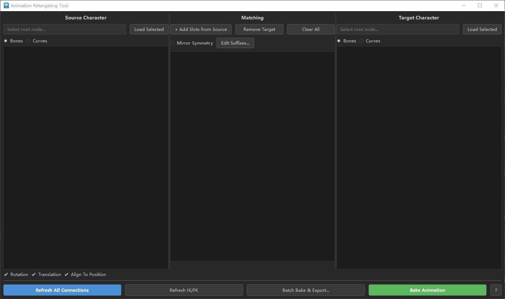
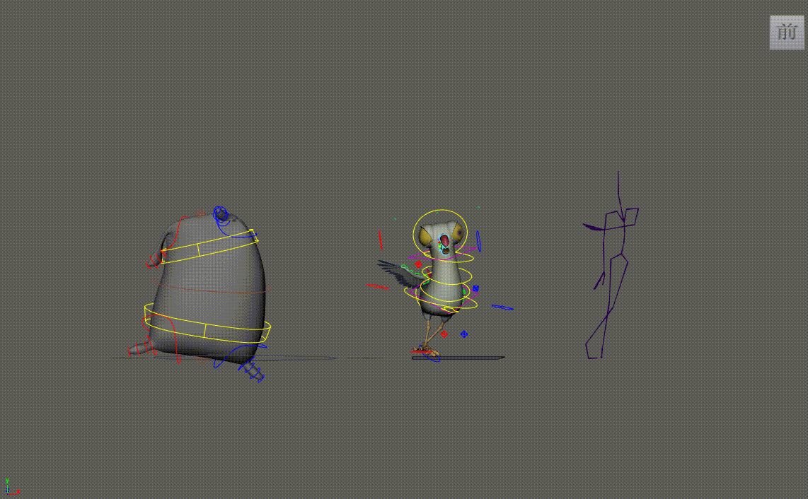
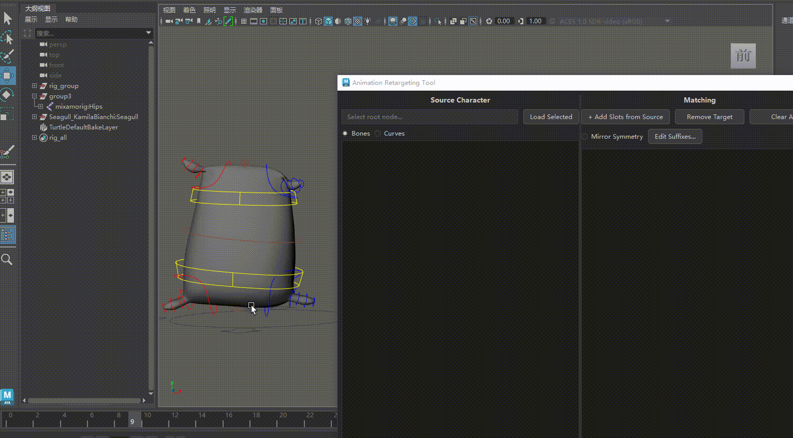
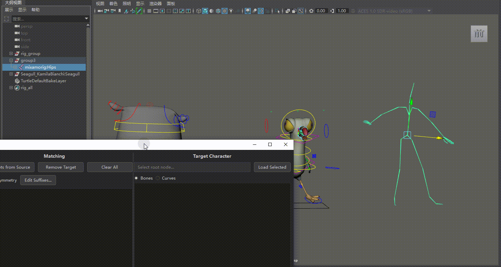
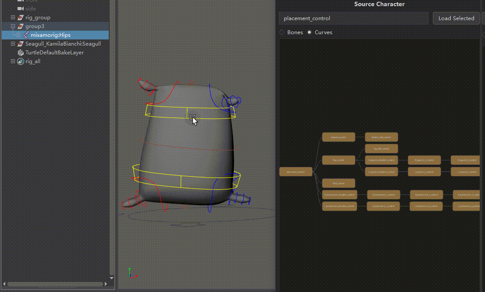

# SimpleRetarget — Animation Retargeting Tool for Maya

> 本工具基于 GitHub 用户 **[joaen](https://github.com/joaen)** 的开源项目 **[animation-retargeting-tool](https://github.com/joaen/animation-retargeting-tool)** 改进而来，在原有功能基础上重新设计了用户界面与交互体验。
>
> This tool is built upon the open-source project **[animation-retargeting-tool](https://github.com/joaen/animation-retargeting-tool)** by GitHub user **[joaen](https://github.com/joaen)**. The UI and interaction experience have been redesigned and improved based on the original functionality.

---




## 简介 / Introduction

**SimpleRetarget** 是一个运行在 Autodesk Maya 中的动画重定向工具。它通过可视化的超图（Hypergraph）界面，让用户以直观的方式建立源角色与目标角色之间的骨骼/控制器映射关系，并通过约束系统将动画从源角色传递到目标角色。

**SimpleRetarget** is an animation retargeting tool for Autodesk Maya. It provides a visual hypergraph-based interface that allows users to intuitively establish bone/controller mappings between a source character and a target character, transferring animation via constraint systems.

---

## 功能特性 / Features

### 双角色超图视图 / Dual Character Hypergraph

- 左侧面板加载 **源角色**（Source Character，带动画的骨骼/绑定）



- 右侧面板加载 **目标角色**（Target Character，接收动画的绑定）



- 支持 **Bones**（关节层级）和 **Curves**（NURBS 曲线控制器层级）两种显示模式
- 超图内按 **F** 键适配视图，与 Maya 视口选择实时同步



---

- Left panel loads the **Source Character** (skeleton/rig with animation)
- Right panel loads the **Target Character** (rig to receive animation)
- Supports both **Bones** (joint hierarchy) and **Curves** (NURBS curve controller hierarchy) display modes
- Press **F** in the hypergraph to fit view; selection syncs in real-time with Maya viewport

### 槽位映射系统 / Slot-Based Mapping

- 从源角色超图选择节点，点击 **"+ Add Slots from Source"** 创建映射槽位
- 在目标角色超图选择节点后，点击槽位右半部分完成目标指定
- 槽位间自动根据源层级关系建立连接边，呈现树状结构
- 状态栏实时显示 `已分配 / 总槽位数`

---

- Select nodes in the source hypergraph and click **"+ Add Slots from Source"** to create mapping slots
- Select a node in the target hypergraph, then click the right side of a slot to assign the target
- Slots automatically connect based on source hierarchy, forming a tree structure
- Status bar shows `assigned / total slots` in real time

### 镜像对称 / Mirror Symmetry

- 勾选 **Mirror Symmetry** 后，添加槽位和指定目标时自动补全镜像侧
- 支持自定义后缀对（如 `_L/_R`、`_Left/_Right`），通过 **"Edit Suffixes..."** 编辑

---

- Enable **Mirror Symmetry** to automatically add mirrored counterparts when creating slots or assigning targets
- Customizable suffix pairs (e.g., `_L/_R`, `_Left/_Right`) via **"Edit Suffixes..."**

### 连接与约束 / Connections & Constraints

- **Rotation** / **Translation** / **Align To Position** 选项，灵活控制约束类型
- 点击 **"Refresh All Connections"** 根据当前映射创建/更新 locator 与约束
- 已连接的节点在超图中显示绿色边框

---

- **Rotation** / **Translation** / **Align To Position** options for flexible constraint control
- Click **"Refresh All Connections"** to create/update locators and constraints based on current mappings
- Connected nodes are highlighted with a green border in the hypergraph

### IK 模式 / IK Mode

- 右键点击槽位选择 **Toggle IK Mode**，为特定映射切换 IK 连接方式
- **"Refresh IK/FK"** 按钮刷新 IK/FK 状态显示，灰显非激活分支

---

- Right-click a slot and select **Toggle IK Mode** to switch to IK connection for specific mappings
- **"Refresh IK/FK"** button refreshes IK/FK state display; inactive branches are grayed out

### 烘焙动画 / Bake Animation

- 点击 **"Bake Animation"** 将约束动画烘焙到目标控制器上
- 烘焙完成后自动清理所有连接节点和辅助属性

---

- Click **"Bake Animation"** to bake constrained animation onto target controllers
- Automatically cleans up all connection nodes and helper attributes after baking

### 批量导出 / Batch Export

- 点击 **"Batch Bake && Export..."** 打开批量导出窗口
- 指定连接绑定文件（`.ma`）和多个动画 FBX 文件
- 支持输出为 `.fbx` 或 `.ma` 格式
- 可选指定导出节点（Export Selected）
- 进度条与颜色状态反馈（黄色=处理中，绿色=成功，红色=失败）

---

- Click **"Batch Bake && Export..."** to open the batch export dialog
- Specify a connection rig file (`.ma`) and multiple animation FBX files
- Supports output in `.fbx` or `.ma` format
- Optional export selection (Export Selected)
- Progress bar with color-coded status feedback (yellow = processing, green = success, red = failed)

---

## 系统要求 / Requirements

| 项目 / Item | 要求 / Requirement |
|---|---|
| **Maya 版本** | 2017 及以上 / 2017 and above |
| **Qt 框架** | 2023<=Maya < 2025: PySide2 + shiboken2（Maya 内置）<br>Maya >= 2025: PySide6 + shiboken6（Maya 内置） |
| **FBX 插件** | 批量导出功能需要 Maya FBX 插件可用 / FBX plugin required for batch export |
| **操作系统** | Windows / macOS（已适配 macOS 窗口标志） |

---

## 安装 / Installation

将 `SimpleRetarget` 文件夹放置到 Maya scripts folder (Username\Documents\maya\scripts)

Place the `SimpleRetarget` folder into the Maya scripts folder (Username\Documents\maya\scripts)

为了在 Maya 中启动工具，你需要打开 Maya 的脚本编辑器然后输入：

```python
import SimpleRetarget
SimpleRetarget.start()
```

⚠️ 记得把它们存为工具栏按钮

icon


To start the tool within Maya, run these lines of code from the Maya script editor or add them to a shelf button:

```python
import SimpleRetarget
SimpleRetarget.start()
```


---

## 使用方法 / Usage

### 基本工作流程 / Basic Workflow

1. **加载源角色** — 在 Maya 视口中选择源角色的根节点（带动画的骨骼或绑定组），在左侧面板点击 **"Load Selected"**
2. **加载目标角色** — 选择目标角色的根节点，在右侧面板点击 **"Load Selected"**
3. **创建映射槽位** — 在源角色超图中选择需要重定向的节点，点击中间面板的 **"+ Add Slots from Source"**
4. **指定目标** — 在目标角色超图中选择对应节点，然后点击槽位的右半部分完成映射
5. **建立连接** — 根据需要勾选 Rotation / Translation / Align To Position，点击 **"Refresh All Connections"**
6. **烘焙动画** — 确认动画效果满意后，点击 **"Bake Animation"** 完成烘焙

---

1. **Load Source Character** — Select the root node of the source character (animated skeleton or rig group) in Maya viewport, click **"Load Selected"** in the left panel
2. **Load Target Character** — Select the root node of the target character, click **"Load Selected"** in the right panel
3. **Create Mapping Slots** — Select nodes to retarget in the source hypergraph, click **"+ Add Slots from Source"** in the center panel
4. **Assign Targets** — Select the corresponding node in the target hypergraph, then click the right side of a slot to complete the mapping
5. **Create Connections** — Check Rotation / Translation / Align To Position as needed, click **"Refresh All Connections"**
6. **Bake Animation** — Once satisfied with the result, click **"Bake Animation"** to finalize

### 快捷操作 / Tips

| 操作 / Action | 说明 / Description |
|---|---|
| 超图内按 **F** | 适配所有节点到视图 / Fit all nodes in view |
| 右键点击槽位 | 切换 IK 模式 或 删除槽位 / Toggle IK mode or remove slot |
| **Bones / Curves** 切换 | 在关节层级和曲线控制器层级间切换显示 / Switch between joint hierarchy and curve controller hierarchy |
| 灰色节点 | 表示当前处于非激活 IK/FK 状态 / Indicates inactive IK/FK state |
| 绿色边框节点 | 表示已建立活跃连接 / Indicates an active connection |

---

## 与原版的主要改进 / Key Improvements over the Original

- **超图可视化界面**：采用可缩放、可平移的 QGraphicsView 超图替代原版的列表式界面，层级关系一目了然
- **槽位树状映射**：中间面板的映射槽位按源层级自动排列为树状结构，比逐行列表更直观
- **镜像对称系统**：内置可自定义后缀的镜像对称功能，大幅提升对称角色的映射效率
- **IK/FK 智能检测**：自动检测并可视化 IK/FK 切换状态，辅助用户判断映射策略
- **Maya 视口同步**：超图选择与 Maya 视口选择双向同步
- **PySide6 兼容**：支持 Maya 2025+ 的 PySide6/shiboken6 环境
- **深色主题 UI**：统一的深色样式表，与 Maya 默认界面风格一致

---

- **Hypergraph Visualization**: Replaced the original list-based UI with a zoomable, pannable QGraphicsView hypergraph for clear hierarchy visualization
- **Tree-Structured Slot Mapping**: Mapping slots in the center panel are automatically arranged in a tree structure based on source hierarchy, more intuitive than a flat list
- **Mirror Symmetry System**: Built-in mirror symmetry with customizable suffixes, greatly improving mapping efficiency for symmetrical characters
- **IK/FK Smart Detection**: Automatically detects and visualizes IK/FK switch states to assist mapping strategy
- **Maya Viewport Sync**: Bidirectional selection sync between hypergraph and Maya viewport
- **PySide6 Compatibility**: Supports Maya 2025+ PySide6/shiboken6 environment
- **Dark Theme UI**: Unified dark stylesheet consistent with Maya's default interface style

---

## 致谢 / Credits

- **[joaen/animation-retargeting-tool](https://github.com/joaen/animation-retargeting-tool)** — 原始动画重定向工具，本项目在其核心功能基础上改进界面与交互而来 / Original animation retargeting tool; this project improves the UI and interaction based on its core functionality

---

## 许可 / License

本工具的界面改进部分遵循原项目的许可条款。请参阅原项目仓库了解详细许可信息。

The UI improvements in this tool follow the license terms of the original project. Please refer to the original repository for detailed license information.
